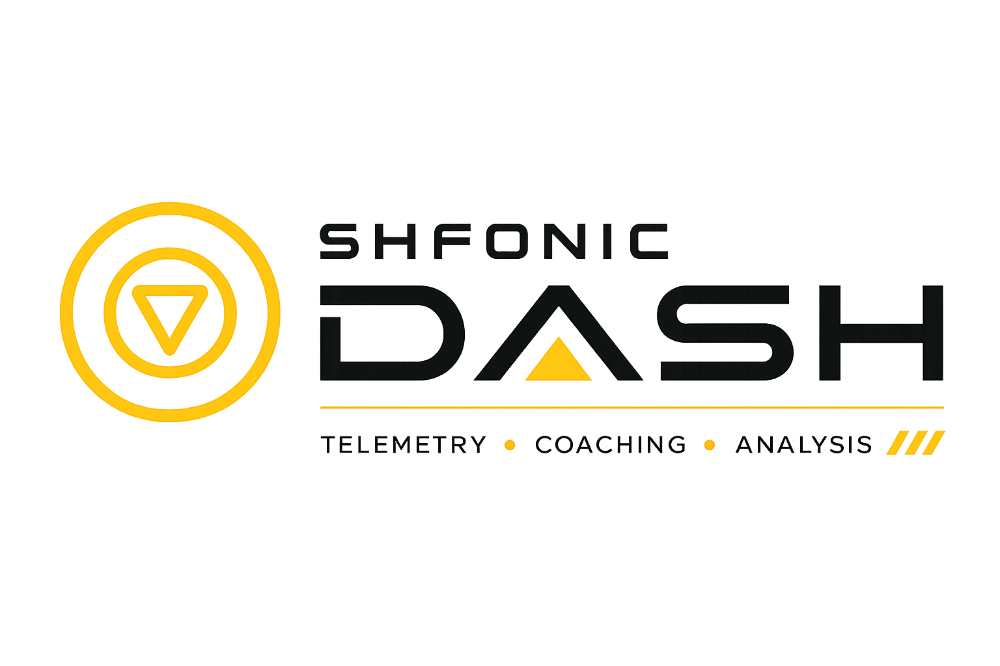
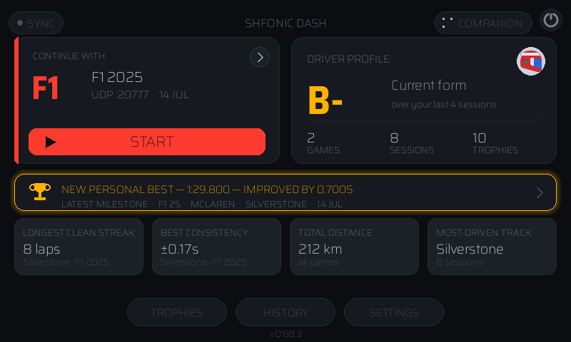
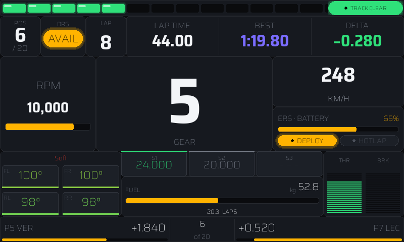
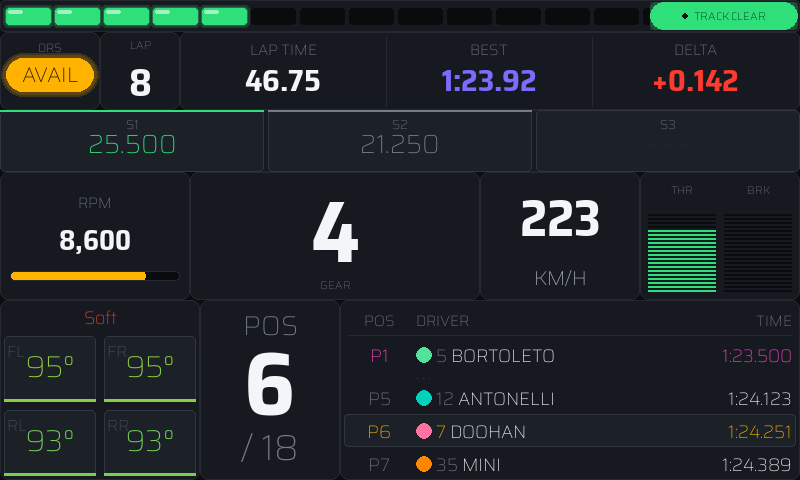
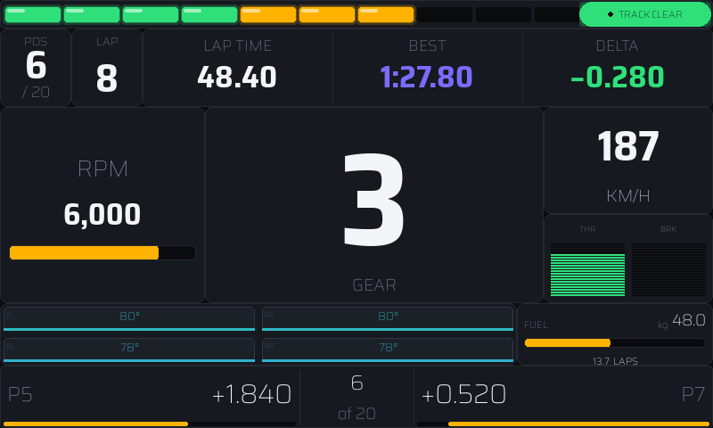
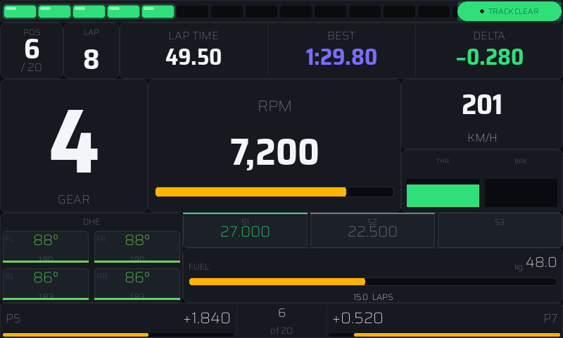
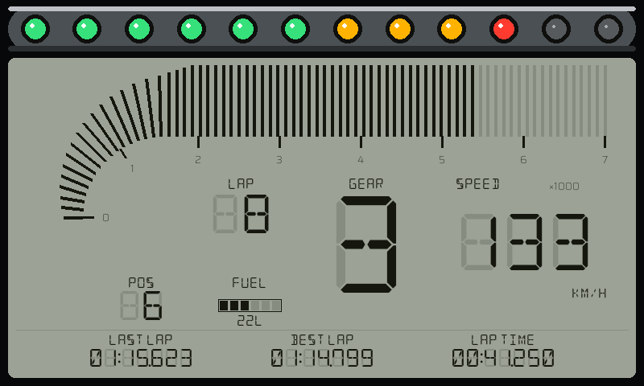
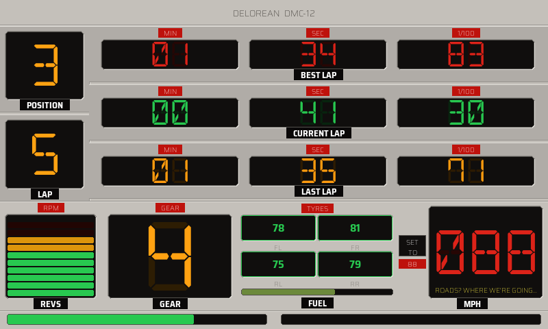

<p align="center">
  <picture>
    <source media="(prefers-color-scheme: dark)" srcset="src/dashboard/images/logo-dark.png">
    
  </picture>
</p>

<p align="center"><em>All the data, none of the excuses.</em></p>

<p align="center">
  <a href="https://shfonic.com">shfonic.com</a>
  &nbsp;·&nbsp;
  <a href="https://shfonic.com/dash/">Product page</a>
</p>

# Shfonic Dash

A Pygame-based telemetry dashboard for sim racing games, designed to run on a
Raspberry Pi 3 with a 7" touchscreen mounted in your cockpit. It listens
passively for UDP telemetry broadcast by the game on your console/PC and
renders a live, game-specific dashboard — gear, speed, RPM, tyres, fuel, lap
times, ERS, and more.

## Disclaimer & Acknowledgments
This is an unofficial, fan-made project and is not affiliated with, endorsed by,
or sponsored by any of the game publishers or developers below. It works by
reading telemetry data broadcast over UDP by these games' built-in telemetry
features, which are published by their developers for use by third-party
companion apps.

- **Assetto Corsa Competizione** is a trademark of KUNOS Simulazioni S.r.l.
- **F1 25** and the F1 UDP telemetry specification are property of Electronic
  Arts Inc. / Codemasters.
- **Project CARS 2** is a trademark of Slightly Mad Studios Ltd. / Bandai Namco
  Entertainment.
- **Forza Motorsport** and **Forza Horizon** are trademarks of Microsoft
  Corporation, developed by Turn 10 Studios and Playground Games.
- **Gran Turismo 7** is a trademark of Sony Interactive Entertainment LLC,
  developed by Polyphony Digital Inc.

All other trademarks are the property of their respective owners.

The driver helmet avatar icon is by **Magnific** — [Flaticon](https://www.flaticon.com/).

### Protocol References

Parsing for these UDP formats was built against each publisher's official
documentation where one exists, and cross-checked against community
documentation and open-source reference implementations otherwise:

- [F1Game.UDP](https://github.com/volodymyr-fed/F1Game.UDP) and the
  [EA F1 24 UDP specification](https://answers.ea.com/t5/General-Discussion/F1-24-UDP-Specification/m-p/13745808)
  for the F1 25/26 packet layout.
- [MacManley/project-cars-2-udp](https://github.com/MacManley/project-cars-2-udp)
  for the Project CARS 2 timings/participants struct layouts.
- [Forza Motorsport Data Out Documentation](https://support.forza.net/hc/en-us/articles/21742934024211-Forza-Motorsport-Data-Out-Documentation)
  and [Forza Horizon 6 Data Out Documentation](https://support.forza.net/hc/en-us/articles/51744149102611-Forza-Horizon-6-Data-Out-Documentation)
  (official Microsoft/Turn 10/Playground Games docs) for the Forza packet layouts.
- [Bornhall/gt7telemetry](https://github.com/Bornhall/gt7telemetry) and
  [Nenkai/PDTools](https://github.com/Nenkai/PDTools) for the Gran Turismo 7
  packet format and Salsa20 decryption scheme.

Thanks to the authors of these projects, and to the publishers who officially
document their formats, for making third-party dashboards like this possible.

## Screenshots

| Game selection menu | F1 25 — Race |
|---|---|
|  |  |

| F1 25 — F2 Qualifying | Forza Horizon 6 — Race |
|---|---|
|  |  |

| GT3 — Race | Formula Ford — LCD dashboard |
|---|---|
|  |  |

Each car class gets its own layout (e.g. GT3, GT4, F1, F2, Formula Ford), and
each switches automatically between practice/qualifying and race configs based
on the live session type. A car can also have a fully custom dashboard — like
the DeLorean DMC-12:

<p align="center">
  
</p>

## Supported Games

| Game | Mode | Port |
|---|---|---|
| F1 25 (and F1 24-format DLC) | Passive UDP listen | 20777 |
| Project CARS 2 | Passive UDP listen | 5606 |
| Forza Horizon (4 / 5 / 6) | Passive UDP "Data Out" | 5301 |
| Forza Motorsport (7 / 2023) | Passive UDP "Data Out" | 5300 |
| Gran Turismo 7 | Active heartbeat (console → Pi) | 33740 |

No pairing or registration is required — just point the game's telemetry/Data
Out settings at the Pi's IP address and the configured port (GT7 auto-discovers
the console via broadcast instead).

## Game & Feature Compatibility

Status per game/feature, kept current with the codebase. See
[ROADMAP.md](ROADMAP.md) for the detailed backlog behind each open item.

| Symbol | Meaning |
|---|---|
| ✅ | Supported and working |
| 🔧 | Supported — in progress |
| 🧪 | Supported — to be tested |
| 🗓 | To be implemented |
| 🔍 | To be investigated (may not be possible) |
| ❌ | Not supported |

### Live dashboards

| Game | Status | Notes |
|---|---|---|
| F1 25 / F1 26 cars (F1, F2, Formula Rookie) | ✅ | Full widget set: gear/speed/RPM/shift lights/pedals, tyres (temp + pressure + wear), fuel, sectors with purple/green/yellow, live per-frame delta, ERS/DRS/pit limiter/Active Aero (2026), position + gaps + qualifying leaderboard, flags/safety car, proximity radar. Sprint session sub-types and a full ERS/DRS pass are still awaiting real race-weekend verification (see ROADMAP). |
| Project CARS 2 | 🧪 | Gear/speed/RPM/pedals/shift lights, tyres (temp/wear/pressure), fuel, sectors 1–3 with flags, position, gaps, flags, weather are all parsed in code, but the race-weekend practice timing path (lap time, delta, position, sectors) is still unverified — it needs a real-session `--record` capture to confirm. No live per-frame delta (end-of-lap delta only) and no qualifying leaderboard yet. |
| Forza Horizon (4/5/6) | 🧪 | Gear/speed/RPM/pedals/shift lights, position, tyre temp, fuel confirmed on real hardware for gear/speed only — tyre temp and fuel fraction are still marked untested on Xbox in ROADMAP. Sectors, gaps/leaderboard, flags and weather aren't in Forza's Data Out packet at all (❌ protocol limitation, not a gap to fill). |
| Forza Motorsport (7/2023) | 🧪 | Same shape as FH6 plus tyre wear. FM7 vs FM2023 packet-size detection and tyre wear still need Xbox verification. Same protocol-level gaps as FH6 for sectors/gaps/flags/weather. |
| Gran Turismo 7 | 🧪 BETA | Parser built from community-documented layout only — **never verified against a real console capture.** Vehicle state, tyre temp, fuel, and pre-race grid position are parsed; the packet has no current-lap time (estimated from packet counter), no sector times, no participants/gaps, and no pit/flag state (❌ not in the protocol). |

### Track Recording

| Game | Status | Notes |
|---|---|---|
| F1 25 / F1 26 | ✅ | Only source that currently feeds `pos_x/pos_y/pos_z/heading` from its Motion packet — the recorder is built and exercised against this. |
| Project CARS 2 | 🗓 | `eParticipantInfo` already carries world position for the player, but it's parsed and discarded — needs wiring into `TelemetryData.pos_*`, same pattern as F1. |
| Forza Horizon / Forza Motorsport | 🗓 | World position is already unpacked from the telemetry struct (`pos_x, pos_y, pos_z`) but never assigned to `TelemetryData` — closer to done than PC2, just needs the assignment + a heading calc from yaw. |
| Gran Turismo 7 | 🔍 | Not yet confirmed the community-documented packet even carries usable world position. Would also need a manual track-selection UI, since GT7 never broadcasts a track name (see Pre-Session Goal Card below). |

### Web Companion

The Pi doubles as a small web server: a browser-based **companion** served under
`/app` that mirrors the on-Pi analysis on your phone or laptop — no app to
install, works on any device on the same network. Scan the QR code from the
game menu (or open `http://<pi-ip>:8765/app`) to reach:

- A **driver profile** hub — overall recent-form grade, career stats, personal
  records, and a trophy gallery
- A browsable **session history** with per-lap tables, tyre stints, sector
  colouring, position/pace charts and the **circuit minimap** (driven line vs
  racing line at mapped tracks)
- **Race Engineer Notes** with corner mini-map thumbnails, a session **journal**,
  and a shareable coaching **brief** you can paste into an AI coach

Every page is rendered from the same recorded session CSVs and the shared
`sessionlog` engine, so the numbers match the Pi exactly. It's read/write over
an authenticated pairing code and runs only while the menu is open by default
(configurable to always-on in settings).

### Other Features

| Feature | Status | Notes |
|---|---|---|
| Session history, grading, achievements/badges, Race Engineer Notes, debrief | ✅ all games | Built entirely from the recorded session CSV via the shared `sessionlog` library — the same engine drives the on-Pi summary/history screens and the web companion, so every renderer shows identical figures. |
| Live per-frame delta (`LapDeltaTracker`) | ✅ F1 · 🗓 PC2/Forza · 🔍 GT7 | Engine is game-agnostic; PC2 and Forza both expose a per-lap distance field to drive it — just needs wiring. GT7's packet doesn't obviously carry lap distance, so it needs investigating first. |
| Pre-session "NEXT GOAL" card | ✅ F1 · ❌ PC2/Forza/GT7 | Requires a track name to look up history against — F1 is the only source that sends one; PC2/Forza/GT7 never broadcast a track name, so this isn't a bug to fix, it's a protocol gap. |
| Corner-located Race Engineer Notes ("at Turn 3, before the apex") | ✅ F1 · 🗓 PC2/Forza · 🔍 GT7 | Needs a recorded track map to place notes against — inherits its status directly from the Track Recording table above, since a game can't have a map until it can record one. Falls back to plain distance-based wording on any game/track with no map yet, including F1 tracks not yet driven/recorded. |
| Record / replay (`--record` / `--replay`) | ✅ all UDP sources | Game-agnostic raw packet capture; the game is auto-detected from the capture header on replay. Not applicable to GT7's active-heartbeat handshake. |

## Features
- Auto-switching dashboards based on car class and session type (practice /
  qualifying / race)
- Shift lights, RPM gauge, gear, speed, throttle/brake, tyre temps/pressures/wear,
  fuel + laps remaining, lap/sector times with purple/green/yellow colouring,
  ERS/DRS (F1), gaps to cars ahead/behind
- Touch-friendly settings overlay: theme picker (5 presets including a High
  Contrast mode), colour-blind safe accent mode, metric/imperial unit toggle
- 180° display flip for upside-down mounting
- Mock telemetry mode for development without a console/PC running the game

## Quick Start (mock mode, no game required)

```bash
cd src
python main.py --mock --no-flip                    # GT3 preset
python main.py --mock --mock-preset f1 --no-flip   # F1 preset
```

On the Pi (display mounted upside-down), omit `--no-flip` and set
`export SDL_VIDEODRIVER=x11` first to avoid EGL errors on Pi OS Lite.

## CLI Flags

| Flag | Description |
|---|---|
| `--game <id>` | Skip the menu and launch a specific game: `f1_25`, `pcars2`, `fh6`, `fm`, `gt7` |
| `--mock` | Use mock telemetry (no game required) |
| `--mock-preset <name>` | Mock preset: `gt3`, `gt4`, `f1`, `f2`, `f1_26`, `formula_rookie`, `pcars2`, `fm`, `fh6`, `gt7` |
| `--mock-session <type>` | Override session type for mock: `race`, `practice`, `qualifying`, `hotlap` |
| `--fps <n>` | Frames per second (default: 30) |
| `--flip` | Flip display 180° (default on Pi) |
| `--no-flip` | Do not flip display (default on Mac/dev) |
| `--show-cursor` | Show the mouse cursor (useful on Mac without a touchscreen) |
| `--debug` | Enable verbose diagnostic output: lap delta milestones, reference profile details, participant packet layout, etc. |

**Typical dev workflow on Mac:**

```bash
cd src
# Mock session, cursor visible, display right-way up
python main.py --mock --mock-preset f1 --mock-session qualifying --no-flip --show-cursor

# Live game with debug logging
python main.py --game f1_25 --no-flip --show-cursor --debug
```

## Raspberry Pi Setup
For a full walkthrough of flashing Pi OS Lite, installing dependencies,
rotating the touchscreen, and configuring auto-start on boot, see
[SETUP.md](SETUP.md).

## HTTP API
The Pi runs a small authenticated HTTP server (port 8765) for pushing and
pulling session data and track maps — enough to build your own client that
syncs, backs up, or analyses sessions. See [docs/api.md](docs/api.md) for the
full endpoint reference (auth, routes, request/response shapes, `curl`
examples).

## Changelog
See [CHANGELOG.md](CHANGELOG.md) for a history of features and fixes.

## License
GPL-3.0 — see [LICENSE](LICENSE).
